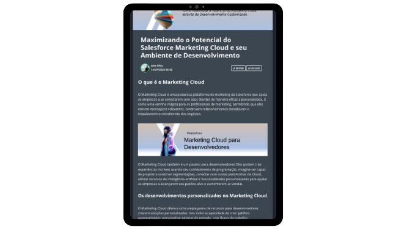

  

# Projeto artigo técnico gerado por I.A.s

 > ℹ️ **NOTE:** Este é o repositório desenvolvido durante o curso ChatGPT for Devs da [DIO](https://dio.me).

## 💻 Tecnologias utilizadas no projeto

- [ChatGPT](https://chat.openai.com/) - para título e conteúdo
- [Lexica.art](https://lexica.art/) - para gerar imagens
- [PowerPoint](https://www.microsoft.com/en/microsoft-365/powerpoint) - Para formatação de banners e Layouts

## 📄 Prompts e ferramentas

ChatGPT：

|   Ação   | prompt                                                                                                                                                                                                                                                                         |
| :------: | ------------------------------------------------------------------------------------------------------------------------------------------------------------------------------------------------------------------------------------------------------------------------------ |
|  título  | crie 10 headlines para nomes de artigos sobre o assunto Salesforce Marketing Cloud para Devs                                                                                                                                                                                                    |
| conteúdo | Comporte-se como um escritor de artigos tech Salesforce e escreva o artigo atendento as regras abaixo

{REGRAS}

> No máximo 5 linhas por blocos de explicação
> Me explique de maneira informal, como se eu fosse uma criança de 10 anos
> Os blocos que serão criados estão abaixo: 
- O que é o Marketing Cloud 
- Marketing Cloud para Desenvolvedores
- O quais desenvolvimentos personalizados tem o Marketing Cloud
- O marketing Cloud no desenvolvimento
    - Cite exemplos com código de desenvolvimento no Marketing Cloud
- Faça um call to action para as minhas redes sociais 
- Coloque 3 hastags que façam sentido|

Lexica.art：

- No léxica utilizamos o acervo público de imagens geradas por outras pessoas, os termos de pesquisa que utilizei durante a gravação do conteúdo foram:

• Salesforce
• Cyber Hacker Blue
• Hacker Dev

## ✨ Features

- Conteúdo gerado via ChatGPT
- Imagens do acervo público geradas via Lexica.art

## 📚 Materiais

- prompts utilizados

## 🛠️ Instruções de execução

Utilize os prompts acima nas ferramentas sugeridas para gerar o material base e utilize uma ferramenta de edição de documentos como power point, libreoffice , indesign para diagramação, o passo a passo em vídeo pode ser conferido na plataforma da [DIO](https://dio.me).
